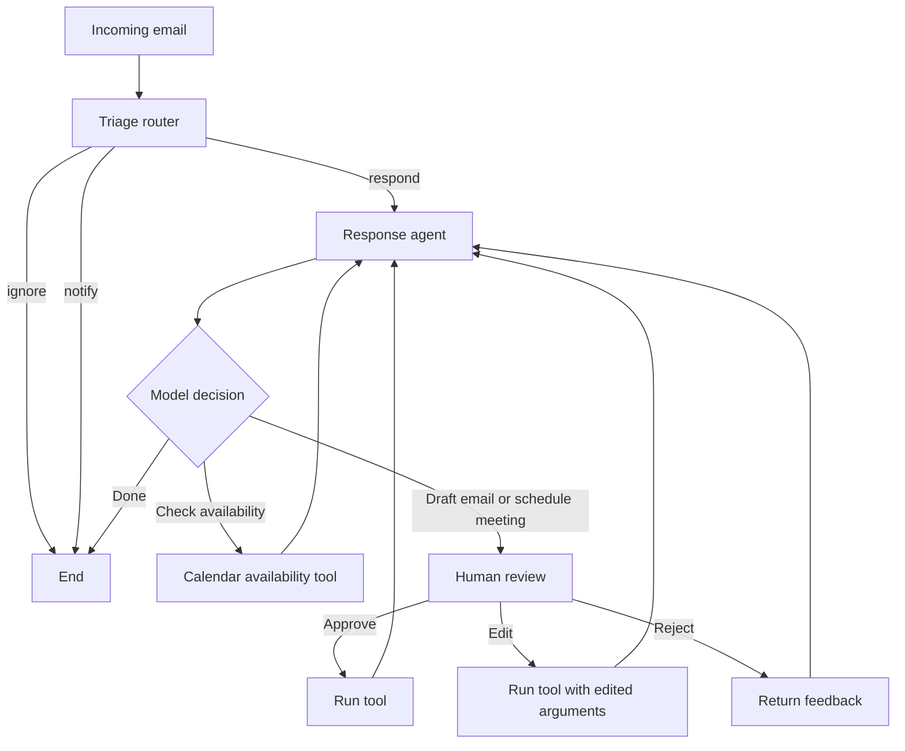

# AI Email Assistant

A LangGraph-based email assistant that triages incoming messages and routes them to the appropriate workflow. It uses structured LLM output to classify emails as `respond`, `notify`, or `ignore`; messages that require a response enter a tool-calling agent with human approval before simulated email or calendar actions are executed.

> **Project status: actively under development.** The LangGraph workflow, triage router, tool-calling loop, and human-review logic are implemented. The production-facing tools for email delivery, calendar availability, meeting scheduling, and notifications are still being developed; the current versions are placeholders used to demonstrate and test the workflow.

## What it demonstrates

- A stateful workflow built with LangGraph `StateGraph`
- Structured email triage with three outcomes: `respond`, `notify`, and `ignore`
- State-based routing from triage into a response agent or directly to the end of the graph
- An agent loop that alternates between the DeepSeek model and tool execution until the task is complete
- Tool calls for drafting an email, checking calendar availability, and scheduling a meeting
- Human-in-the-loop review for email and meeting actions, supporting `approve`, `edit`, and `reject` decisions
- Configuration for running the graph with LangGraph's local development tooling

## Workflow



### 1. Triage

The `triage_router` parses the incoming email and asks the model for a structured `RouterSchema` result. Its classification determines the next state:

- `respond` - adds the email to the message state and routes it to the response agent
- `notify` - records the decision and ends the current workflow
- `ignore` - records the decision and ends the current workflow

### 2. Response agent

For emails classified as `respond`, the agent selects one tool at a time and loops between `llm_call` and `tool_handler`. A `Done` tool call terminates the workflow.

Available tools:

| Tool | Purpose | Current implementation |
| --- | --- | --- |
| `write_email` | Draft/send an email response | Returns a simulated success message |
| `check_calendar_availability` | Find available times for a day | Returns fixed example time slots |
| `schedule_meeting` | Create a calendar meeting | Returns a simulated success message |
| `Done` | Signal that email handling is complete | Ends the agent loop |

### 3. Human review

`write_email` and `schedule_meeting` are treated as real-world actions. Before either tool runs, the graph pauses with LangGraph's `interrupt()` mechanism and asks for a review decision:

- `approve` - run the proposed tool call
- `edit` - run it with reviewer-supplied arguments
- `reject` - skip the action and return feedback to the agent

Calendar availability checks do not require approval because they are read-only in the workflow.

## Tech stack

- Python 3.11-3.13
- LangGraph
- LangChain
- DeepSeek via `langchain-deepseek`
- Pydantic
- LangGraph CLI

## Project structure

```text
.
|-- langgraph.json
|-- pyproject.toml
`-- src/email_assistant/
    |-- agent.py              # Graphs, routing, agent loop, and human review
    |-- prompts.py            # Triage and response-agent prompts
    |-- schemas.py            # Graph state and structured router schema
    |-- utils.py              # Email parsing and tool lookup helpers
    `-- tools/
        `-- email_tools.py    # Email and calendar tool definitions
```

## Getting started

### Prerequisites

- Python 3.11, 3.12, or 3.13
- A DeepSeek API key
- [`uv`](https://docs.astral.sh/uv/) (recommended) or another Python package manager

### Installation

```bash
git clone https://github.com/yzhengbw/my_email_agent.git
cd my_email_agent
uv sync
```

Create a `.env` file in the project root:

```dotenv
DEEPSEEK_API_KEY=your_api_key_here
```

The `.env` file is excluded from version control.

### Run locally

Start the LangGraph development server:

```bash
uv run langgraph dev
```

The graph is registered as `email_agent` in `langgraph.json`. A valid input has the following shape:

```json
{
  "email_input": {
    "author": "Recruiter <recruiter@example.com>",
    "to": "Hazel <hazel@example.com>",
    "subject": "Interview availability",
    "email_thread": "Could you share your availability for an interview next week?"
  }
}
```

When the response agent proposes an email or meeting action, execution pauses until the caller resumes the graph with an approval, edited arguments, or rejection feedback.

## Development status

- This is an actively developed project, not a finished or production-ready application.
- Real email and calendar integrations are under development. The current tools return simulated results and do not yet connect to external services.
- The notification tool is also under development. For now, the `notify` route records the classification and ends the workflow without delivering a notification.
- Triage preferences and user background are currently defined in code.
- The project does not yet include automated tests, authentication, persistent user settings, deployment configuration, or production monitoring.
- The configured model is `deepseek-v4-flash`; availability depends on the model names supported by the installed provider and the user's account.

## Possible next steps

- Connect Gmail and Google Calendar APIs behind the existing tool interfaces
- Add a notification channel for `notify` classifications
- Move user preferences into configuration or persistent storage
- Add unit and integration tests for routing, tool selection, and review decisions
- Add durable checkpointing for paused human-review workflows
